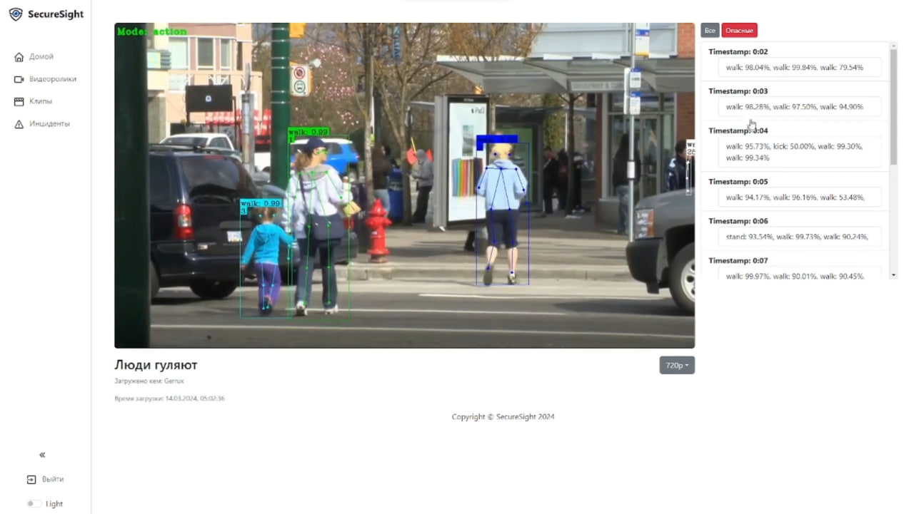

# SecureSight 


Securesight - это мощный инструмент, который использует передовые технологии компьютерного зрения для анализа видеоданных в реальном времени. Он идентифицирует действия человека, повышая уровень безопасности и эффективность систем наблюдения. Благодаря продвинутым алгоритмам, Securesight обеспечивает быстрое и точное обнаружение угроз.

# Содержание

1. [Ключевые возможности](#ключевые-возможности)
2. [Технологии](#технологии)
   - [Backend](#backend)
   - [Frontend](#frontend)
3. [Установка и запуск](#установка-и-запуск)
   - [Запуск Microservice (SecureSight Assistant)](#установка-и-запуск)
   - [Запуск Backend](#запуск-backend)
   - [Запуск Frontend](#запуск-frontend)

# Ключевые возможности

- **Анализ видеоданных в реальном времени**: Securesight не просто записывает видео, он анализирует его в реальном времени, обеспечивая мгновенную реакцию на любые аномалии.
- **Обнаружение потенциально опасных действий**: Благодаря продвинутым алгоритмам, Securesight может обнаруживать потенциально опасные действия и предупреждать об этом.
- **Интуитивно понятный пользовательский интерфейс**: Securesight предлагает удобный и понятный пользовательский интерфейс, который делает управление системой простым и эффективным.


# Технологии

### Microservice и AI
- **FastAPI**: Современный, быстрый (высокопроизводительный) веб-фреймворк для построения API с использованием Python 3.7+, базирующийся на стандартах открытого API.
- **Uvicorn**: Сервер ASGI для развертывания приложений FastAPI, обеспечивающий высокую производительность и поддержку WebSockets.
- **trt_pose**: Библиотека для реального времени оценки позы человека, оптимизированная с использованием TensorRT от NVIDIA для улучшения производительности.
- **torch**: Популярная библиотека глубокого обучения, предоставляющая широкий спектр инструментов для разработки и обучения нейронных сетей.
- **scikit-learn**: Библиотека машинного обучения, содержащая широкий набор алгоритмов для классификации, регрессии, кластеризации и других задач обработки данных.
- **cv2 (OpenCV)**: Мощная библиотека для компьютерного зрения, содержащая множество алгоритмов для обработки изображений и видео, обнаружения объектов и лиц, трекинга и др.

### Backend

- **Django Rest**: Предоставляет мощный и гибкий фреймворк для создания API.
- **SQLite**: Легкий и надежный движок базы данных.
- **JWT**: Стандарт авторизации для обеспечения безопасности.
- **Celery**: Распределенная система управления очередями задач.
- **Redis**: Используется в качестве брокера сообщений для Celery.

### Frontend

- **React**: Популярная библиотека JavaScript для создания пользовательских интерфейсов.
- **Bootstrap**: Помогает создавать отзывчивые и красивые веб-дизайны.
- **video-js**: Предоставляет красивый видеоплеер.

## Установка и запуск

### Запуск Microservice (SecureSight Assistant)

Подробная информация [здесь](microservice/README.md).

### Запуск Backend

Склонируйте репозиторий:

```bash
git clone https://github.com/Gerrux/securesight.git
```

Перейдите в каталог проекта:

```bash
cd securesight
```

Создайте и запустите контейнер Docker:
```bash
docker build -t securesight-backend .
docker run -p 8000:8000 securesight-backend
```

#### Запуск в DEV

Для запуска Backend выполните следующие команды:

```bash
python manage.py makemigrations
python manage.py migrate
python manage.py runserver
docker run --name my-redis -p 6379:6379 redis
celery --app securesight worker -l info --pool=solo
```

### Запуск Frontend

Подробная информация [здесь](frontend/README.md).



#### Запуск в DEV

Для запуска Frontend выполните следующие команды:

```bash
cd ./frontend/
npm start
```

Авторы
------

* Калинин Илья ([Gerrux](https://github.com/Gerrux))
* Покрышкин Даниил ([dstish](https://github.com/dstish))
