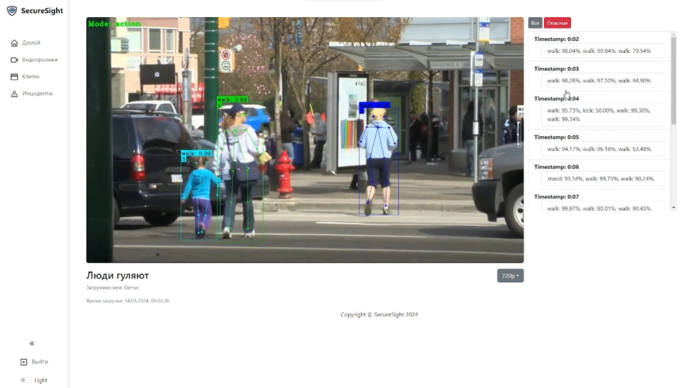

SecureSight Frontend
=====================

Описание
--------

SecureSight Frontend - это веб-приложение, разработанное на React. Оно предоставляет пользовательский интерфейс для системы безопасности и мониторинга SecureSight.



Установка и запуск
-----------------

1. Склонируйте репозиторий:
```bash
git clone https://github.com/Gerrux/securesight.git
```
2. Перейдите в каталог проекта:
```bash
cd securesight/frontend
```
3. Создайте и запустите контейнер Docker:
```bash
docker build -t securesight-frontend .
docker run -p 80:80 securesight-frontend
```
Приложение будет доступно по адресу: `http://localhost`.

Авторы
------

* Калинин Илья ([Gerrux](https://github.com/Gerrux))
* Покрышкин Даниил ([dstish](https://github.com/dstish))